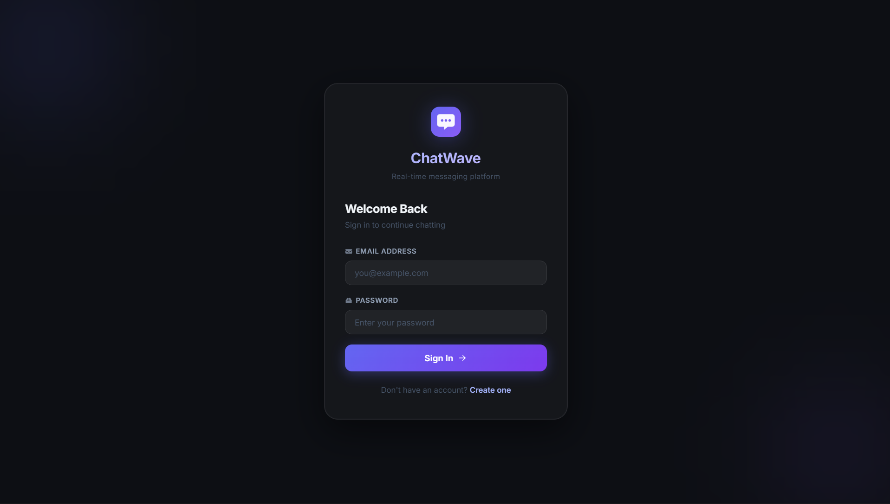
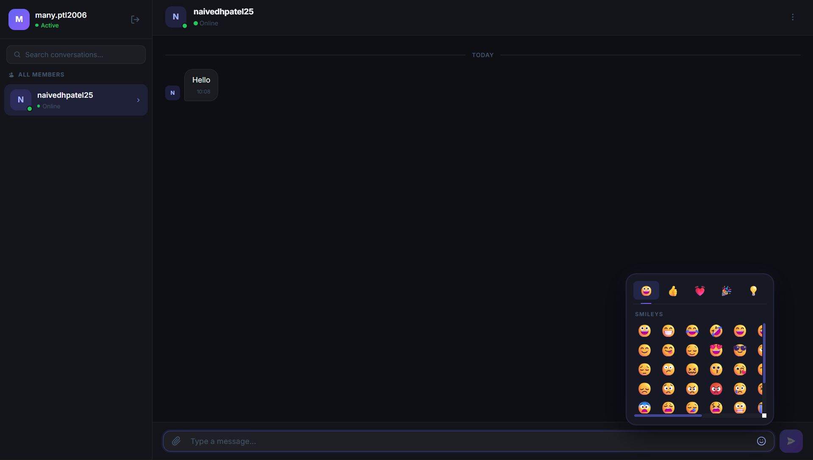

# 💬 ChatWave

### Real-Time Chat Application

[](https://www.mongodb.com/)
[](https://expressjs.com/)
[](https://angular.io/)
[](https://nodejs.org/)
[](https://socket.io/)

> A full-stack real-time chat application with instant messaging, online presence, typing indicators, and a premium dark-mode UI.

</div>

---

## 📸 Screenshots

<div align="center">

|                           Login Page                            |                           Chat Interface                           |
| :-------------------------------------------------------------: | :----------------------------------------------------------------: |
|  |  |

</div>

---

## ✨ Features

| Feature                    | Description                                       |
| -------------------------- | ------------------------------------------------- |
| 🔐 **JWT Authentication**  | Secure register & login with hashed passwords     |
| 💬 **Real-Time Messaging** | Instant delivery via Socket.IO private channels   |
| 🟢 **Online Presence**     | Live online/offline status for all users          |
| ⌨️ **Typing Indicators**   | Animated bouncing-dot typing indicator            |
| 📎 **File Sharing**        | Attach files — sends filename + size as a message |
| 😀 **Emoji Picker**        | 5-category tabbed emoji panel (160+ emojis)       |
| 💾 **Message History**     | Full chat history persisted in MongoDB            |
| 🌙 **Premium Dark UI**     | Glassmorphism design with indigo gradient theme   |
| 📋 **Chat Menu**           | Clear chat, copy username, sign out dropdown      |

---

## 🚀 Getting Started

### Prerequisites

| Tool        | Version                 |
| ----------- | ----------------------- |
| Node.js     | ≥ 18.x                  |
| npm         | ≥ 9.x                   |
| Angular CLI | `npm i -g @angular/cli` |
| MongoDB     | Atlas free tier         |

### Installation

**1. Clone the repository**

```bash
git clone https://github.com/naivedhP2518/Chat-Web.git
cd Chat-Web
```

**2. Setup Backend**

```bash
cd backend
npm install
cp .env.example .env
# Edit .env with your MongoDB URI and JWT secret
npm run dev
```

> Backend runs at: `http://localhost:5000`

**3. Setup Frontend**

```bash
cd frontend
npm install
npm start
```

> Frontend runs at: `http://localhost:4200`

---

## 🌍 Environment Variables

Create `backend/.env` using the template in `.env.example`:

| Variable     | Description                     | Example             |
| ------------ | ------------------------------- | ------------------- |
| `PORT`       | Server port                     | `5000`              |
| `MONGO_URI`  | MongoDB Atlas connection string | `mongodb+srv://...` |
| `JWT_SECRET` | JWT signing secret              | `your_secret_key`   |

> ⚠️ **Never commit `.env` to GitHub** — it contains sensitive credentials.

---

## 📡 API Reference

### Auth — `/api/auth`

| Method | Endpoint    | Auth   | Body                          | Description         |
| ------ | ----------- | ------ | ----------------------------- | ------------------- |
| `POST` | `/register` | ❌     | `{username, email, password}` | Register new user   |
| `POST` | `/login`    | ❌     | `{email, password}`           | Login & receive JWT |
| `GET`  | `/users`    | ✅ JWT | —                             | Get all users       |

### Messages — `/api/messages`

| Method | Endpoint   | Auth   | Body                  | Description        |
| ------ | ---------- | ------ | --------------------- | ------------------ |
| `GET`  | `/:userId` | ✅ JWT | —                     | Fetch chat history |
| `POST` | `/`        | ✅ JWT | `{receiver, message}` | Save a new message |

---

## 🔌 Socket.IO Events

| Event            | Direction       | Description                   |
| ---------------- | --------------- | ----------------------------- |
| `userOnline`     | Client → Server | Register user as online       |
| `onlineUsers`    | Server → All    | Broadcast updated online list |
| `sendMessage`    | Client → Server | Send private message          |
| `receiveMessage` | Server → Client | Deliver message to receiver   |
| `typing`         | Client → Server | Notify typing started         |
| `stopTyping`     | Client → Server | Notify typing stopped         |

---

## 🗂️ Project Structure

```
Chat-Web/
├── backend/
│   ├── config/db.js            ← MongoDB connection
│   ├── controllers/            ← Business logic (auth)
│   ├── middleware/auth.js      ← JWT verification
│   ├── models/                 ← User & Message schemas
│   ├── routes/                 ← API route definitions
│   ├── server.js               ← Express + Socket.IO entry
│   ├── .env.example            ← Environment variable template
│   └── package.json
│
├── frontend/
│   └── src/app/
│       ├── components/         ← login, register, chat
│       ├── services/           ← AuthService, ChatService
│       ├── app.routes.ts       ← Route definitions
│       └── styles.css          ← Global dark theme
│
├── assets/                     ← Screenshots for README
├── README.md
└── .gitignore
```

---

## 🧱 Tech Stack

| Layer         | Technology           | Purpose                         |
| ------------- | -------------------- | ------------------------------- |
| **Database**  | MongoDB Atlas        | Store users & messages          |
| **ODM**       | Mongoose             | Schema + query helpers          |
| **Backend**   | Node.js + Express    | REST API server                 |
| **Auth**      | JWT + bcryptjs       | Secure login & password hashing |
| **Real-time** | Socket.IO            | Live messaging & presence       |
| **Frontend**  | Angular 19           | Standalone component SPA        |
| **HTTP**      | Angular HttpClient   | REST API calls                  |
| **Styling**   | Vanilla CSS          | Dark glassmorphism theme        |
| **Fonts**     | Google Fonts (Inter) | Premium typography              |

---

Built with ❤️ using the MEAN Stack

<div align="center">
  <sub>⭐ Star this repo if you found it helpful!</sub>
</div>
